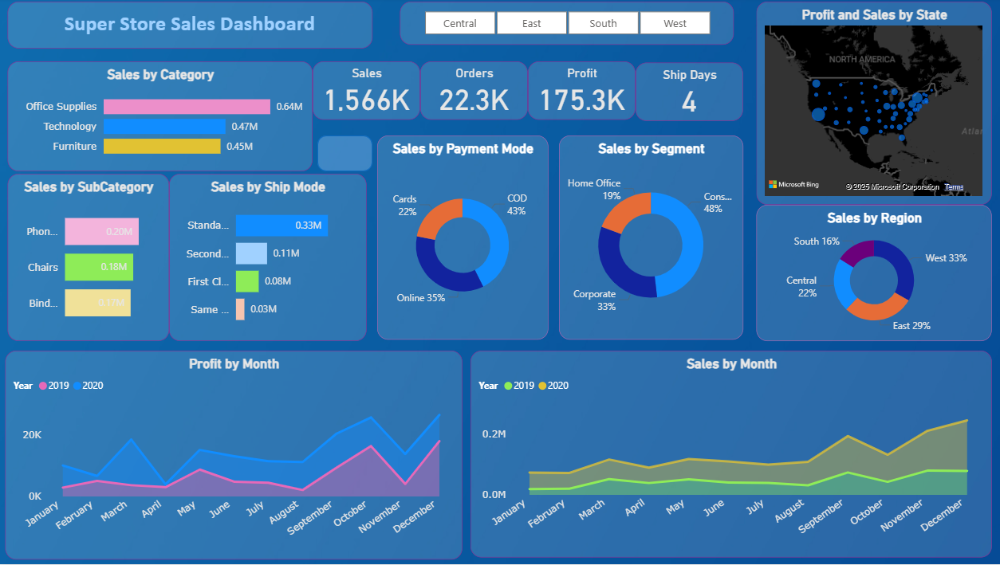
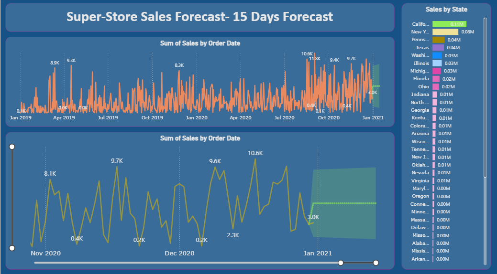

# 📊 SuperStore Sales Analysis & Forecasting (Power BI Project)

## 📌 Objective
To contribute to the success of the SuperStore business by utilizing **data analysis** and **time series forecasting** techniques.  
The project aims to provide valuable insights into sales performance and generate accurate **15-day sales forecasts**, helping in **strategic decision-making** and improving overall efficiency.

---

## 🛠️ Project Description
This project was developed using **Power BI**, with the following key components:

1. **Dashboard Creation**
   - Identified KPIs such as Sales, Orders, Profit, and Ship Days.
   - Designed an **intuitive and interactive Power BI dashboard**.
   - Added filtering capabilities (by region, category, state, etc.).

2. **Data Analysis**
   - Provided insights into **sales by category, subcategory, region, segment, and shipping mode**.
   - Visualized customer purchase patterns and regional performance.
   - Compared yearly profit and sales trends (2019 vs 2020).

3. **Sales Forecasting**
   - Applied **time series analysis** on historical data.
   - Forecasted sales for the **next 15 days** with confidence intervals.

4. **Actionable Insights & Recommendations**
   - Shared data-driven insights to support **strategic decision-making**.
   - Suggested improvements for sales, operations, and customer satisfaction.

---

## 📂 File Structure

SuperStore-Sales-Analysis/
│
├── data/
│ └── SuperStore_Sales_Dataset.csv # Dataset used
│
├── dashboard/
│ └── SuperStoreSalesAnalysis.pbix # Power BI project file
│
├── images/
│ ├── superStoreSalesAnalysis.png # Dashboard screenshot
│ └── super_store_sales_forecasting.png # Forecasting screenshot
│
└── README.md

---

## 📊 Dashboard Screenshots

### Sales Dashboard

### Sales Forecasting (15 Days)

---

## 🔍 Sample Insights
- **Category Sales**: Office Supplies (0.64M) was the highest, followed by Technology (0.47M) and Furniture (0.45M).  
- **Customer Segment**: Consumer segment contributed **48%** of total sales.  
- **Payment Mode**: COD accounted for **43%** of transactions, while Online contributed **35%**.  
- **Regional Sales**: West region contributed **33%**, followed by East (**29%**) and Central (**22%**).  
- **Profit Trends**: Profit spiked in **December 2020**, driven by holiday sales.  

---

## 📈 Conclusion & Recommendations
- Focus on **Consumer Segment** since it generates the highest sales.  
- Encourage **online payments** by offering incentives to reduce COD dependency.  
- Increase **marketing efforts in East & Central regions** to balance sales distribution.  
- Improve **shipping efficiency** (reduce days for standard delivery).  
- Stock more **Office Supplies & Technology products**, as they drive maximum revenue.  
- Use **forecasting insights** to prepare inventory and staffing for upcoming demand spikes.  

---

## 🚀 Tools & Technologies
- **Power BI** (Data Visualization & Forecasting)  
- **CSV Dataset** (SuperStore Sales Data)  
- **Time Series Analysis** (Forecasting Model)  

---

## 👨‍💻 Author

**Kulvant Dhaker**  
*Data Analyst*

- 📧 **Email**: dhakerkulvant@gmail.com
- 💼 **LinkedIn**: [linkedin.com/in/dhakerkulvant01](https://www.linkedin.com/in/dhakerkulvant01)
- 🔗 **GitHub**: [github.com/DhakerKulvant](https://github.com/DhakerKulvant)

*Transforming data into actionable business insights*

---
